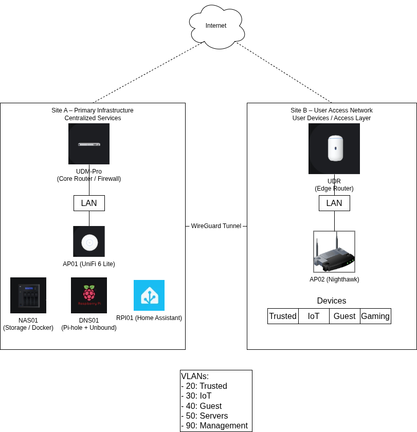
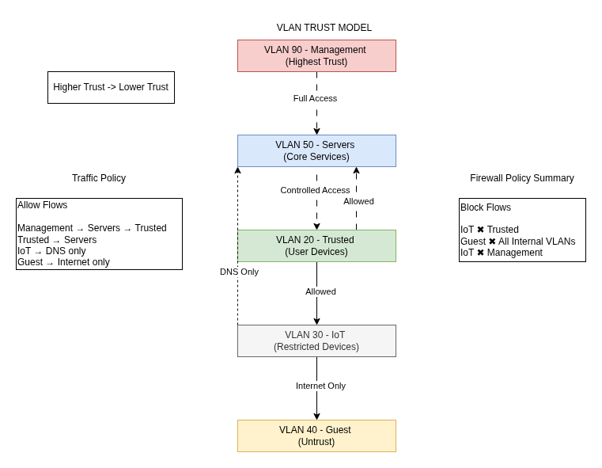
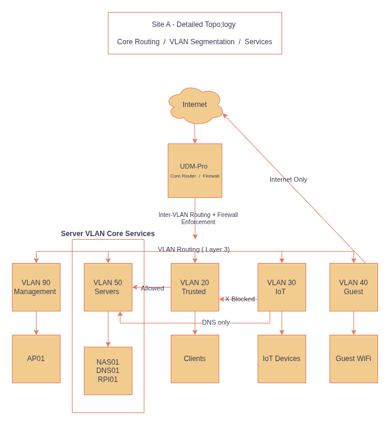

# Enterprise-Style Homelab Network

##  Network Architecture



##  VLAN Trust Model



##  Site A Detailed Topology



## 💡 What This Demonstrates

This project demonstrates the design and implementation of a multi-site network with:

• VLAN-based segmentation aligned to trust boundaries  
• firewall-enforced inter-VLAN access control using a deny-by-default model  
• centralized services including DNS and infrastructure systems  
• secure connectivity using VPN (WireGuard)  
• real-world traffic flow control and network isolation  

It reflects practical, hands-on experience building and operating a production-style network environment.

---

## 🔗 Repository Overview

This repository contains full documentation, diagrams, and design details for the environment.

The environment simulates a small-scale enterprise network with:

* multi-site architecture (primary infrastructure + remote access site)
* VLAN-based segmentation aligned to trust zones
* deny-by-default firewall enforcement
* centralized infrastructure and service hosting
* secure remote access and site-to-site connectivity
* production-style documentation and design standards

---

## 🧠 Architecture Highlights

* VLAN segmentation based on trust boundaries (not device type)
* Consistent IP addressing scheme across multiple sites
* Explicit firewall-controlled inter-VLAN communication
* Separation of infrastructure, services, and endpoint networks
* Wireless networks mapped directly to security zones
* Centralized DNS filtering with recursive resolution (Pi-hole + Unbound)
* VPN architecture supporting both remote access and site-to-site connectivity

---

## 🧩 Technologies Used

* Ubiquiti UniFi (UDM Pro, APs)
* Pi-hole + Unbound (DNS filtering and recursion)
* WireGuard (VPN)
* DD-WRT / OpenWRT (edge networking)
* Docker (self-hosted services)

---

## 🔐 Network Segmentation Model

The network follows a hierarchical trust model:

```
Admin
↓
Infrastructure
↓
Servers
↓
Trusted / Work
↓
Gaming
↓
Kids
↓
IoT
↓
Guest
↓
Quarantine
```

All segments are isolated by default.
Access between zones is explicitly permitted through firewall policy.

---

## 🛠️ Skills Demonstrated

This project reflects hands-on experience in:

* network segmentation and VLAN design
* firewall policy design (deny-by-default model)
* multi-site network architecture
* VPN design (remote access and site-to-site)
* DNS architecture (filtering + recursive resolution)
* infrastructure planning and service placement
* technical documentation aligned with enterprise practices

---

## 🎯 Purpose

This repository is part of a broader effort to develop practical, real-world skills in network engineering and infrastructure design.

It demonstrates the ability to:

* design secure, segmented network environments
* apply zero-trust-inspired principles
* implement production-style infrastructure patterns
* document systems clearly and professionally

---

## 🛠️ Troubleshooting Example

### Issue: IoT devices unable to resolve DNS

- Identified IoT VLAN was isolated from internal services
- Verified DNS server placement in VLAN 50 (Servers)
- Implemented controlled firewall rule allowing IoT → DNS only
- Maintained segmentation while restoring required functionality

**Result:**  
IoT devices regained DNS access without exposing internal network resources.

---

## 📈 Future Enhancements

* infrastructure automation (IaC: Terraform / Ansible)
* monitoring and observability (Prometheus / Grafana)
* high-availability DNS design
* advanced routing and policy-based traffic control
* containerized service expansion

---

## 📚 Documentation

Detailed design documentation is organized by component:

* network overview
* IP addressing plan
* VLAN segmentation
* firewall policy
* wireless design
* VPN architecture
* DNS architecture
* network topology

---

## 📌 Notes

This is a **sanitized environment**.
IP ranges, hostnames, and identifiers have been modified for public sharing.
