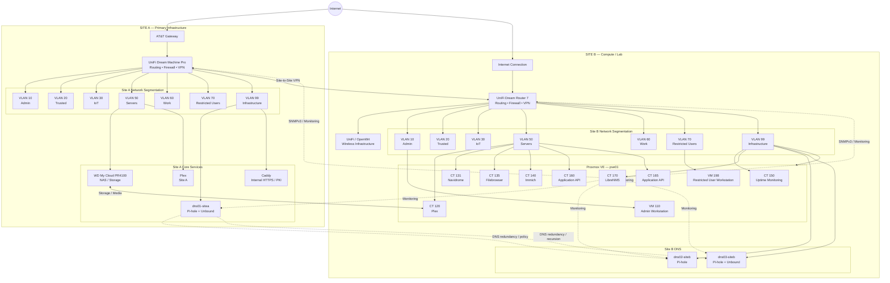

# Full Multi-Site Infrastructure Topology

This diagram provides a sanitized logical overview of the Site A and Site B infrastructure environment.

```mermaid
flowchart TB

    INTERNET((Internet))

    %% =========================================================
    %% SITE A
    %% =========================================================

    subgraph SITEA["SITE A — Primary Infrastructure"]
        direction TB

        ATT["AT&T Gateway"]
        UDMP["UniFi Dream Machine Pro<br/>Routing • Firewall • VPN"]

        ATT --> UDMP

        subgraph A_NETWORKS["Site A Network Segmentation"]
            A10["VLAN 10<br/>Admin"]
            A20["VLAN 20<br/>Trusted"]
            A30["VLAN 30<br/>IoT"]
            A50["VLAN 50<br/>Servers"]
            A60["VLAN 60<br/>Work"]
            A70["VLAN 70<br/>Restricted Users"]
            A99["VLAN 99<br/>Infrastructure"]
        end

        UDMP --> A10
        UDMP --> A20
        UDMP --> A30
        UDMP --> A50
        UDMP --> A60
        UDMP --> A70
        UDMP --> A99

        subgraph A_SERVICES["Site A Core Services"]
            NAS["WD My Cloud PR4100<br/>NAS / Storage"]
            DNS1["dns01-sitea<br/>Pi-hole + Unbound"]
            CADDY["Caddy<br/>Internal HTTPS / PKI"]
            PLEXA["Plex<br/>Site A"]
        end

        A50 --> NAS
        A99 --> DNS1
        A99 --> CADDY
        A50 --> PLEXA
    end

    %% =========================================================
    %% SITE B
    %% =========================================================

    subgraph SITEB["SITE B — Compute / Lab"]
        direction TB

        SITEBISP["Internet Connection"]
        UDR7["UniFi Dream Router 7<br/>Routing • Firewall • VPN"]
        WIRELESS["UniFi / OpenWrt<br/>Wireless Infrastructure"]

        SITEBISP --> UDR7
        UDR7 --> WIRELESS

        subgraph B_NETWORKS["Site B Network Segmentation"]
            B10["VLAN 10<br/>Admin"]
            B20["VLAN 20<br/>Trusted"]
            B30["VLAN 30<br/>IoT"]
            B50["VLAN 50<br/>Servers"]
            B60["VLAN 60<br/>Work"]
            B70["VLAN 70<br/>Restricted Users"]
            B99["VLAN 99<br/>Infrastructure"]
        end

        UDR7 --> B10
        UDR7 --> B20
        UDR7 --> B30
        UDR7 --> B50
        UDR7 --> B60
        UDR7 --> B70
        UDR7 --> B99

        subgraph PVE["Proxmox VE — pve01"]
            ADMIN["VM 110<br/>Admin Workstation"]
            PLEXB["CT 120<br/>Plex"]
            NAVI["CT 131<br/>Navidrome"]
            FILES["CT 135<br/>Filebrowser"]
            IMMICH["CT 140<br/>Immich"]
            UPTIME["CT 150<br/>Uptime Monitoring"]
            API1["CT 160<br/>Application API"]
            API2["CT 165<br/>Application API"]
            LIBRE["CT 170<br/>LibreNMS"]
            RUSER["VM 198<br/>Restricted User Workstation"]
        end

        B99 --> PVE

        B10 --> ADMIN
        B50 --> PLEXB
        B50 --> NAVI
        B50 --> FILES
        B50 --> IMMICH
        B99 --> UPTIME
        B50 --> API1
        B50 --> API2
        B99 --> LIBRE
        B70 --> RUSER

        subgraph DNSB["Site B DNS"]
            DNS2["dns02-siteb<br/>Pi-hole"]
            DNS3["dns03-siteb<br/>Pi-hole + Unbound"]
        end

        B99 --> DNS2
        B99 --> DNS3
    end

    %% =========================================================
    %% WAN / INTER-SITE CONNECTIVITY
    %% =========================================================

    INTERNET --> ATT
    INTERNET --> SITEBISP

    UDMP <-->|Site-to-Site VPN| UDR7

    %% =========================================================
    %% DNS REDUNDANCY
    %% =========================================================

    DNS1 -.->|DNS redundancy / policy| DNS2
    DNS1 -.->|DNS redundancy / recursion| DNS3

    %% =========================================================
    %% MONITORING
    %% =========================================================

    LIBRE -.->|SNMPv3 / Monitoring| UDMP
    LIBRE -.->|SNMPv3 / Monitoring| UDR7
    LIBRE -.->|Monitoring| PVE
    LIBRE -.->|Monitoring| DNS1
    LIBRE -.->|Monitoring| DNS2
    LIBRE -.->|Monitoring| DNS3

    %% =========================================================
    %% STORAGE
    %% =========================================================

    NAS <-->|Storage / Media| PLEXB
```